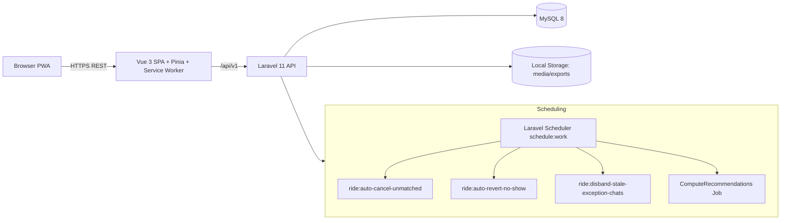
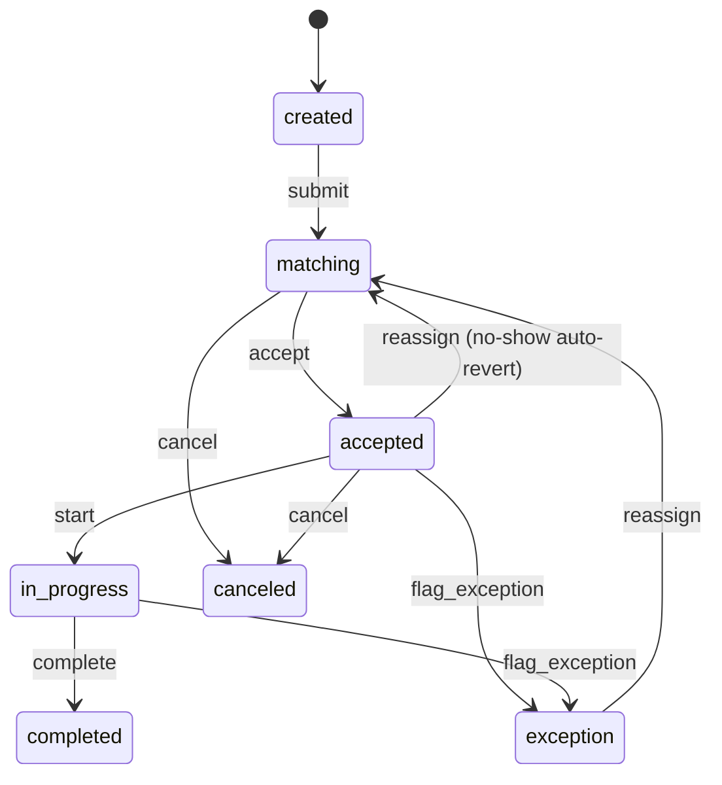

# RoadLink Design Document

## Architecture Diagram

## RideOrder State Machine

## Tech Stack Justification

- Laravel 11 provides strong request validation, policies, middleware, queue/scheduler primitives, and deterministic REST behavior for offline replay patterns.
- Vue 3 + Pinia + Vite keeps the UI modular, fast, and easy to run locally with PWA support for offline shell caching.
- MySQL 8 centralizes transactional workflows (ride state transitions, purchases, idempotency keys, recommendations, reports).
- Local filesystem storage avoids cloud dependencies and satisfies offline-first constraints for media and CSV exports.
- Workbox-backed service worker + IndexedDB queue enables queued write operations with idempotency keys and reconnect sync.

## Security + Traceability Notes

- Group chat membership is stateful: active participation requires `group_chat_participants.left_at IS NULL`.
- Fleet dispatch is separated from driver self-service through dedicated `/api/v1/fleet/*` routes and policies.
- Recommendation reproducibility is versioned through structured feature-set tables instead of model snapshot JSON alone.

## Offline/No-External Dependency Notes

- No external map, payment, auth, recommendation, or notification providers are required for core operation.
- Region mapping for reports uses bundled local JSON at `repo/backend/database/data/regions.json`.
- Recommendation batch jobs run in Laravel scheduler using PHP/MySQL aggregations only.
